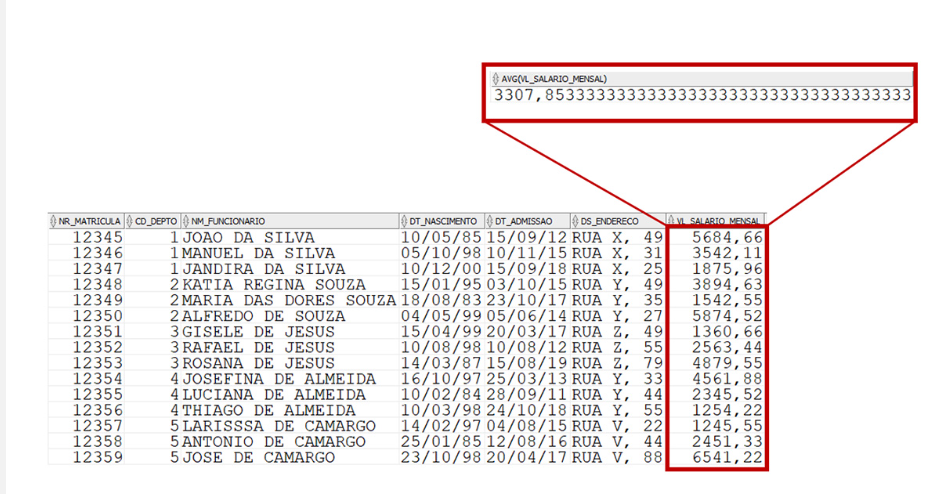

```
SELECT [ coluna, ] funçao_de_grupo (coluna)
   FROM tabela
[ WHERE condição ]
   [ GROUP BY coluna ]
     [ HAVING condiçao ]
  [  ORDER BY coluna [, coluna, ...]
```


´´´
SELECT STDDEV(VL_SALARIO_MENSAL) 
FROM T_SIP_FUNCIONARIO;

´´´




