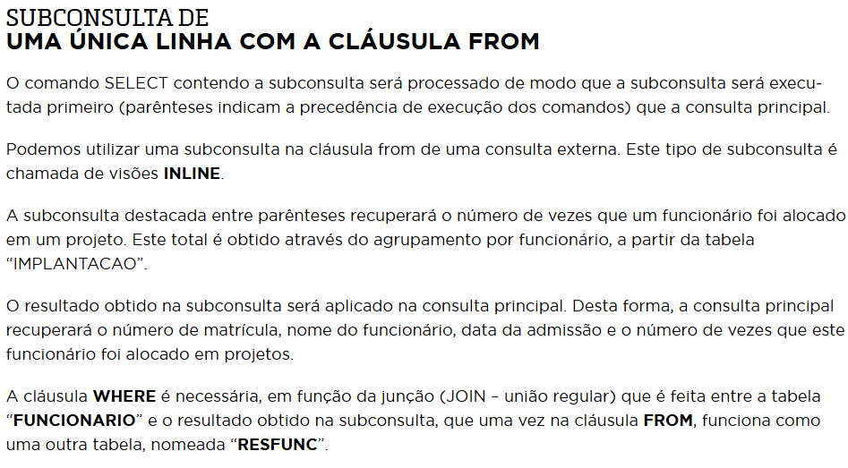
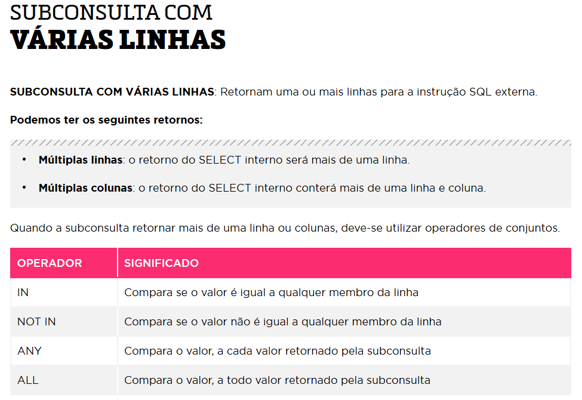
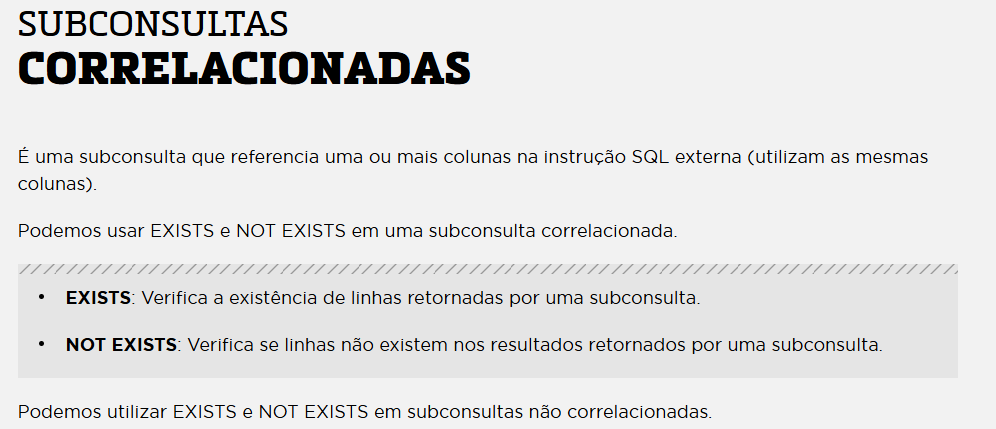

# 📚 Subconsultas e Consultas Internas em SQL

Este repositório apresenta exemplos práticos e explicações sobre o uso de **subconsultas** (consultas internas) em SQL, uma ferramenta poderosa para escrever consultas mais dinâmicas, flexíveis e inteligentes.

---

## 🧠 O que são Subconsultas?

Subconsultas, também conhecidas como **consultas internas**, são comandos `SELECT` que ficam **aninhados dentro de outra consulta SQL**. Elas são utilizadas para retornar valores que a consulta externa pode usar como filtro, cálculo ou condição.

---

## 🧩 Tipos de Subconsultas

### 🔸 Subconsulta de Única Linha
Retorna apenas **um valor** (linha e coluna). Usada com operadores como:
- `=`, `<>`, `>`, `<`, `>=`, `<=`

```sql
-- Exemplo: Funcionários com salário maior que o do funcionário 12348
SELECT NM_FUNCIONARIO, VL_SALARIO_MENSAL
FROM T_SIP_FUNCIONARIO
WHERE VL_SALARIO_MENSAL > (
    SELECT VL_SALARIO_MENSAL
    FROM T_SIP_FUNCIONARIO
    WHERE NR_MATRICULA = 12348
);
```


## ✅ Quando Usar Subconsultas?

- Comparar valores dinâmicos (como média, máximo ou salário de alguém)
- Eliminar a necessidade de valores fixos
- Reaproveitar lógica complexa sem reescrever

---

## 📌 Observações

- Subconsultas podem impactar performance em grandes bases de dados.
- Em muitos casos, JOINs e CTEs podem ser mais eficientes.


## Sub Consultas Cláusula FROM





```sql
-- EXEMPLO – SUBCONSULTA DE UMA ÚNICA LINHA,
 -- COM CLÁUSULA FROM
   SELECT F.NR_MATRICULA ,
          F.NM_FUNCIONARIO , 
          F.DT_ADMISSAO  , 
          RESFUNC.QTDEALOCACAO
   FROM   T_SIP_FUNCIONARIO F , 
                         (
                          SELECT  NR_MATRICULA , 
                                    COUNT(NR_MATRICULA) QTDEALOCACAO
                              FROM  T_SIP_IMPLANTACAO  
                          GROUP BY  NR_MATRICULA                                  
                          ) RESFUNC
                               
  WHERE F.NR_MATRICULA = RESFUNC.NR_MATRICULA ;
```

## Criando Tabelas com Consultas

```sql
-- Criando Tabelas a partir de subconsultas

-- EXEMPLO – SUBCONSULTA PARA CRIAR TABELAS
CREATE TABLE T_TESTE_AULA_ON AS 
              SELECT * FROM T_SIP_IMPLANTACAO;
```


## Sub Consultas Várias Linhas



```sql
--=======================================================================
-- Sub Consultas de múltiplas linhas
-- operadores de comparação são:
-- IN | ANY | ALL | NOT IN

-- EXEMPLO – SUBCONSULTA COM VÁRIAS LINHAS,
 -- COM OPERADOR IN
 SELECT CD_IMPLANTACAO ,
        CD_PROJETO     , 
  NR_MATRICULA "FUNCIONARIO"
   FROM T_SIP_IMPLANTACAO 
  WHERE CD_PROJETO IN
           (
             SELECT CD_PROJETO
               FROM T_SIP_PROJETO 
                    WHERE TO_CHAR(DT_INICIO,'MM/YYYY') IN('04/2012','10/2013')
                  );
```

## Sub consultas Correlacionadas



```sql
-- EXEMPLO – SUBCONSULTA CORRELACIONADA,
-- COM EXISTS
 SELECT F.NR_MATRICULA,
     F.NM_FUNCIONARIO
  FROM T_SIP_FUNCIONARIO F
 WHERE EXISTS
            (
              SELECT I.NR_MATRICULA
                FROM T_SIP_IMPLANTACAO I
               WHERE F.NR_MATRICULA=I.NR_MATRICULA
            );

```

