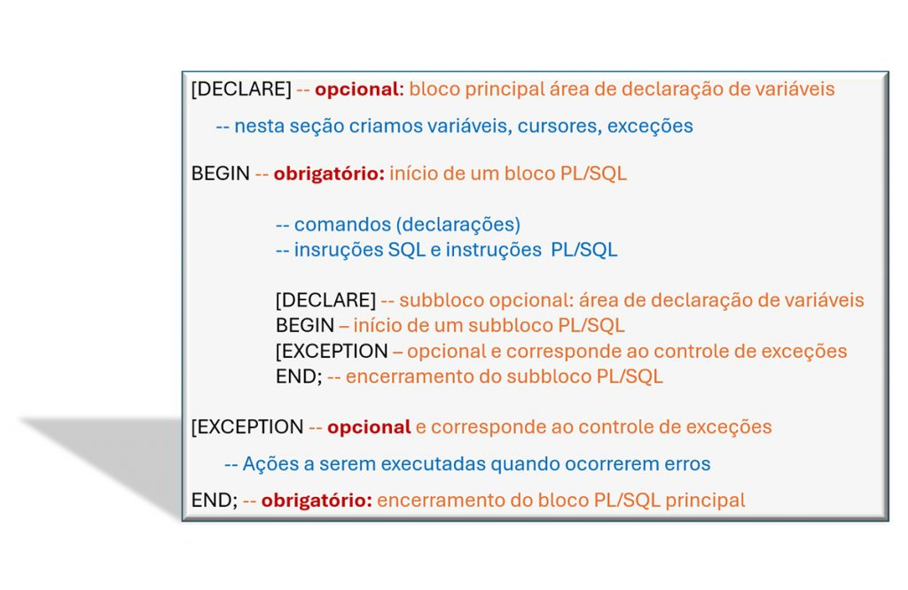
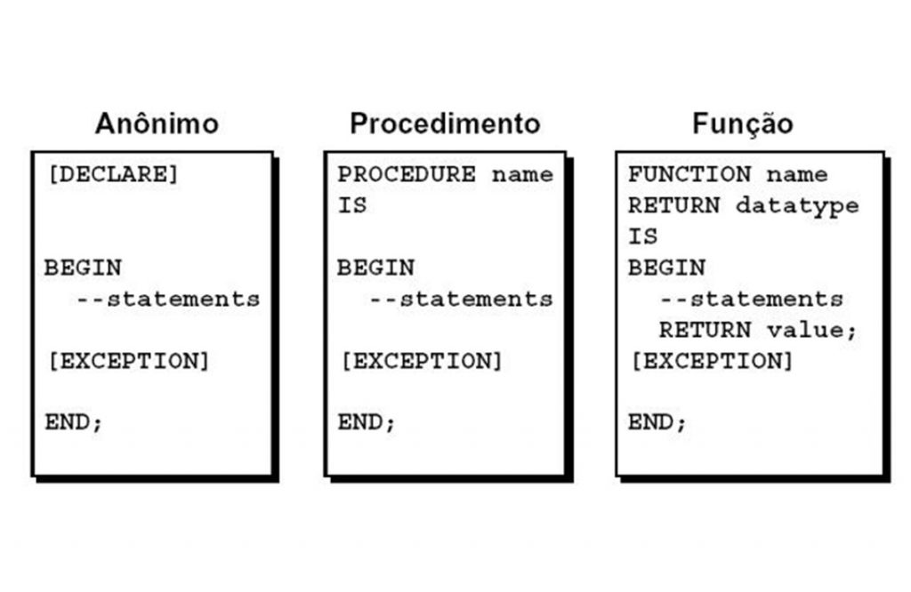

# PL/SQL: Programação em Banco de Dados Oracle

## Introdução

O PL/SQL (Procedural Language extensions to SQL) é uma linguagem de programação procedural desenvolvida pela Oracle Corporation para ampliar as capacidades do SQL.

### Histórico
- A Oracle se tornou líder de mercado nos anos 1980
- Em 1996, lançou a linguagem PL/SQL para superar limitações do SQL puro
- Continua sendo a principal linguagem para desenvolvimento no Oracle Database

## Necessidade de programação em bancos de dados

### Limitações do SQL tradicional:
1. Natureza não procedural (execução sequencial sem controle de fluxo)
2. Descentralização do código fonte (lógica distribuída em sistemas externos)
3. Falhas de segurança em aplicações client-server
4. Baixo desempenho em operações complexas

## Características do PL/SQL

### Público-Alvo:
- Desenvolvedores de aplicações que interagem com Oracle Database
- Profissionais com conhecimento em lógica de programação e SQL

### Principais Recursos:
- Linguagem estruturada em blocos
- Integração perfeita com SQL
- Controles de fluxo (condicionais, loops)
- Tratamento de exceções
- Alta performance para operações no banco

### Requisitos:
- Oracle Database instalado e operacional
- Ferramentas como SQL*Plus, SQL Developer ou similares

## Arquitetura PL/SQL

### Estrutura Básica de Blocos:
```sql
DECLARE
    -- Seção declarativa (opcional)
    -- Variáveis, constantes, cursores, exceções
BEGIN
    -- Seção executável (obrigatória)
    -- Comandos PL/SQL e SQL
EXCEPTION
    -- Seção de tratamento de erros (opcional)
END;
```


# Arquitetura PL/SQL
É uma linguagem estruturada em blocos

quem podem ter blocos dentro de blocos

DECLERATE 
    Declara as variaveis, cursores, exceções
BEGIN
    Inicia o BLoco

End;
    Fecha o Bloco




### 3 Tipos

Anônimo
Procedimento 
Função



Anonimo  não possui nome expecifico sao uteis para testes rapidos

Blocos nomeados são uteis para operações realizadas com frequencia 


### Variaveis e constantes
O PL/SQL permite declarar variaveis e depois ultiliza-las

Data Types -> Varchar, Char, Date, Number, Boolean ou Binary_integer

```sql
--
-- código fonte disponível 
-- no arquivo cap_1_script_2.sql
--
DECLARE
	
	-- Cria a variável v_nr_cliente que poderá receber ate 7 números inteiros (9.999.999)
	v_nr_cliente 		number(7);
	
	-- Cria a variável v_verifica_estoque que poderá receber 2 possíveis valores: TRUE ou FALSE
	v_verifica_estoque	boolean;
	
BEGIN

	-- O comando NULL; não faz nada, mas permite que o bloco begin...end; seja executado com sucesso.
	NULL; -- Dentro de um bloco PL/SQL é necessário ter um comando válido e "NULL;" é considerado um desses comandos.
	
END;
```

Usar o For Loop

```sql
--
-- código fonte disponível do arquivo cap_1_script_5.sql
--
set serveroutput on;

DECLARE
    
	-- Tipo de tabela PL/SQL para armazenar os IDs das lojas
    TYPE tb_nr_loja IS TABLE OF NUMBER;
    TYPE tb_nr_estoque IS TABLE OF NUMBER INDEX BY BINARY_INTEGER;

    -- Variáveis para armazenar os IDs das lojas e o estoque 
    v_nr_loja tb_nr_loja;
    v_qt_estoque tb_nr_estoque;

    -- Quantidade de ingredientes a serem adicionados (simulando a atualização)
    v_qt_ingredientes NUMBER := 100;

    -- -- Procedure local para atualizar o estoque
    PROCEDURE prc_atualiza_estoque_loja(p_v_nr_loja IN tb_nr_loja, p_v_qt_ingredientes IN NUMBER) IS
    BEGIN
        FOR i IN p_v_nr_loja.FIRST .. p_v_nr_loja.LAST LOOP
            v_qt_estoque(p_v_nr_loja(i)) := v_qt_estoque(p_v_nr_loja(i)) + p_v_qt_ingredientes;
            DBMS_OUTPUT.PUT_LINE('Estoque atualizado para a loja ID: ' || p_v_nr_loja(i) || ' - Novo estoque: ' || v_qt_estoque(p_v_nr_loja(i)));
        END LOOP;
    END prc_atualiza_estoque_loja;

BEGIN
    -- Simulação de IDs das lojas e estoque inicial
    v_nr_loja := tb_nr_loja(1, 2, 3, 4, 5); -- Simulando 5 lojas com IDs 1 a 5
    v_qt_estoque(1) := 50;
    v_qt_estoque(2) := 60;
    v_qt_estoque(3) := 70;
    v_qt_estoque(4) := 80;
    v_qt_estoque(5) := 90;

    -- Chama a procedure para atualizar o estoque
    prc_atualiza_estoque_loja(v_nr_loja, v_qt_ingredientes);

END;


```


### Cursores
O cursor é uma contrução PL/SQL que permite nomear uma área de trabalho e acessar infos em memoria

explique sobre cursores

