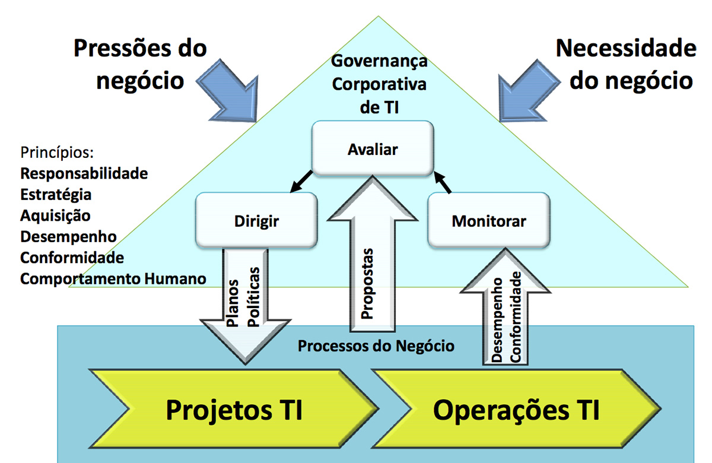
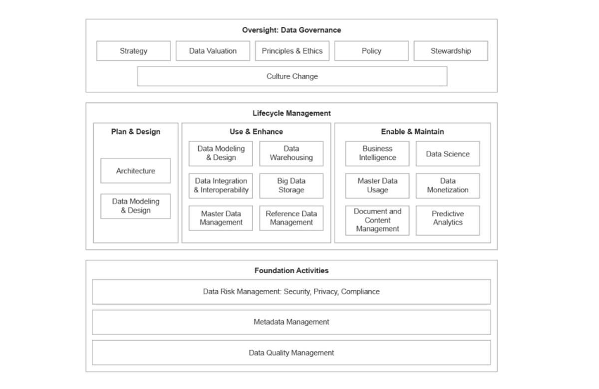
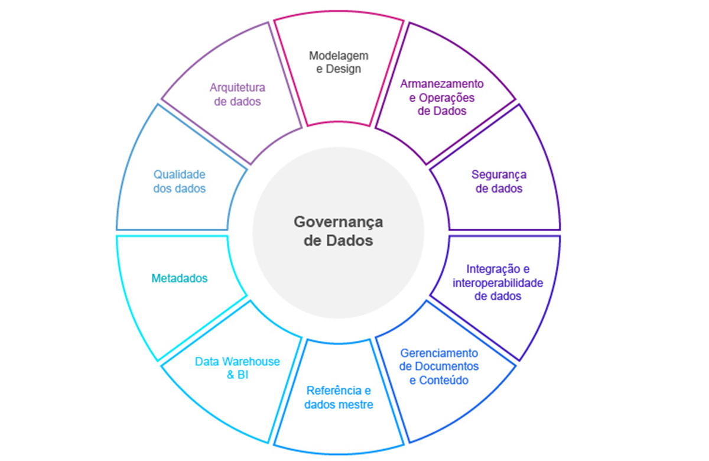
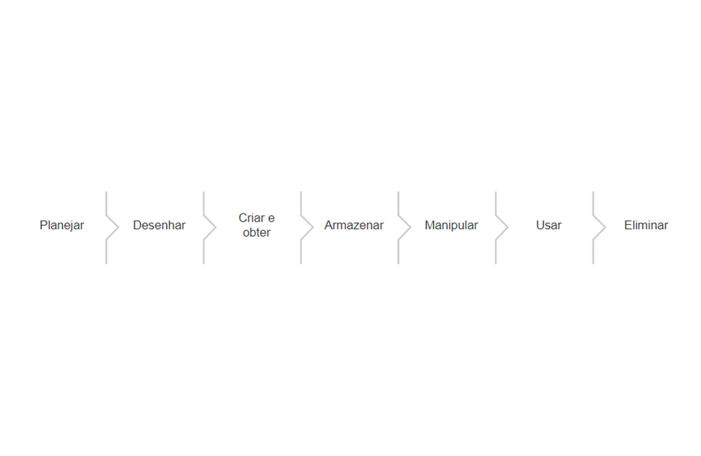
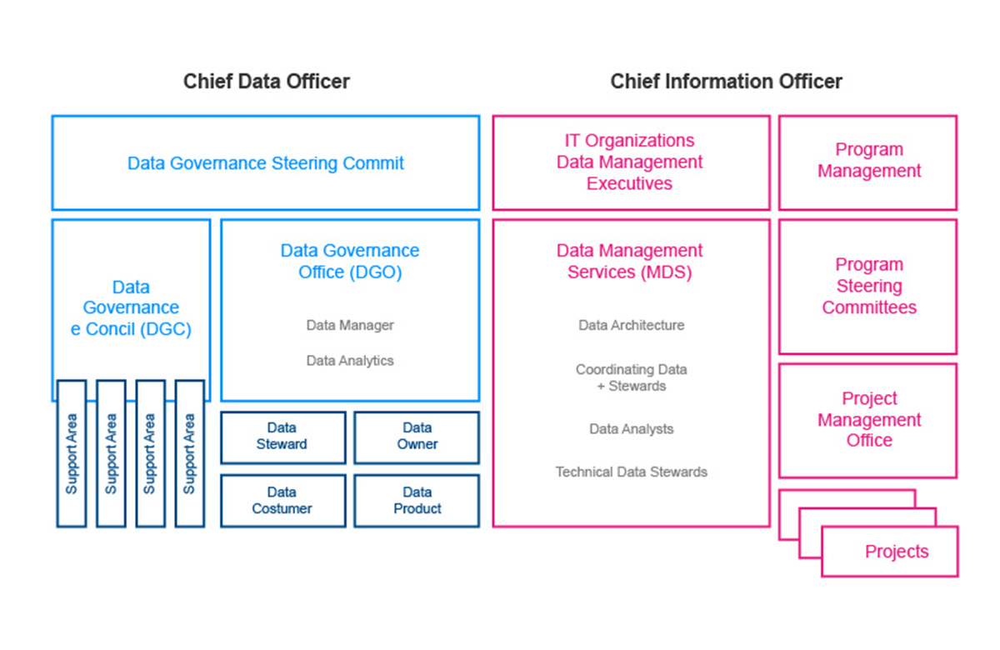

# 📊 Data Governance

## 🔍 Data, Information, and Knowledge: Are They the Same Thing?

Although often confused, **data**, **information**, and **knowledge** are distinct concepts—yet they complement each other.

---

### 📌 **Data**
It is a **raw symbol or value** representing something from the real world.

💡 **Example:**  
You're at the supermarket and see a product. The number on the price tag (R$ 15.90) is **data**—it shows what the store is charging, but without context, it's just a number.

---

### 🧠 **Information**
This occurs when **we give meaning to data**, based on our prior knowledge.

💡 **Example:**  
You look at the price and think: *"This product is expensive!"*  
Now, the data has **meaning** for you. This is **information**.

---

### 🎓 **Knowledge**
This is when **information, combined with experience**, generates **learning**.

💡 **Example:**  
You buy the product, use it, and realize its high quality. Now you understand **why the price was higher**. This experience generates **knowledge**.

> ✅ **Summary:**  
> - Data → symbol or value  
> - Information → meaning assigned to data  
> - Knowledge → learning generated by experience with information  

---

## ⚙️ What Is a System?

A **system** is a set of elements that **interact with each other** for a common purpose.  
Systems are everywhere: in nature, businesses, technology...

🔗 How these elements connect determines the system's behavior.

---

### 🔄 Basic System Operation

A system typically follows this flow:

1. 🟢 **Input:** receives one or more data points
2. 🔧 **Processing:** manipulates or transforms the data
3. 🟣 **Output:** generates new data or results

🔁 In many cases, the **output can loop back as input**, adjusting the system based on feedback.

---

### 🖥️ Information System

In an **information system**:

- 📥 **Data** enters the system
- ⚙️ It is processed through calculations, analysis, or organization
- 📤 And generates **information** as output

> 💡 **Tip:**  
> What a system processes is **data**, and the value generated depends on how it is handled.

---

# � Corporate Governance, IT Governance, and Data Governance

## 💻 The Importance of IT in Corporate Governance

Corporate Governance guides the strategic role of Information Technology (IT) within organizations. IT is a key ally in achieving the company's strategic goals, regardless of its size (large, medium, or small). Among its main contributions are:

- ✅ **Improving organizational processes**  
- ✅ **Enhancing employee performance**  
- ✅ **Collecting and analyzing data to support decision-making**  

Thus, aligning IT with the organization's objectives becomes essential for business success.

---

## ❓ So, What Is Governance?

Governance can be understood as a **set of organized networks** that guide how management, decision-making, and transparency are conducted for stakeholders (MILANI; SOLINS, 2002).  

It acts as a **regulatory mechanism** focused on the **continuous improvement of processes**, influenced by administrative boards, shareholders, directors, and other stakeholders.  

**Corporate Governance**, therefore, enables **more assertive decision-making**, always following ethical and legal principles, forming a **continuous cycle of organizational evolution**.

---

## 🗂️ Data Governance

**Data Governance** is defined as the **exercise of authority and control** (including planning, monitoring, and enforcement) over the management of data assets 📊 (DAMA DMBoK®, 2020).

Even organizations without a formal governance program make data-related decisions. However, those that structure a specific program gain **greater control, authority, and value over their data**.

### 📌 Key Responsibilities of Data Governance:

- 🏷️ Classifying information as a strategic asset  
- 🔄 Orchestrating people, processes, and technologies  
- 🔁 Managing the complete data lifecycle  
- 🗣️ Promoting discussions about data usage  
- 🧾 Defining responsibilities and policies  
- ✅ Ensuring compliance with norms and procedures  
- 🔧 Managing changes and internal communication  

According to Fernandes and Abreu (2012), data governance should be **based on policies, norms, and constraints**, and may vary depending on the organization's focus. However, to be effective, it requires:

- 📖 Clarity in **organizational definitions**  
- 📊 Understanding **data management needs**  
- 🎯 Establishing **clear operational objectives**

---

## 🧩 Components of Data Governance

Data governance is structured around **three main pillars:**

### 👥 People
- ❓ Who makes decisions about data?  
- ❓ Who is consulted?  
- ❓ Who manages data processes?  
- ❓ Who inputs data into the system?

### 🔄 Processes
- 📥 How, where, and when is data collected?  
- 🧩 What rules are applied?  
- 🔗 How do processes relate to data?

### 💡 Technologies
- 🛠️ What tools are used to capture and maintain data?  
- 🧾 Where is data created, stored, and presented?

---

# 📚 DAMA Framework

**DAMA** (*Data Management Association*) is a nonprofit, vendor-independent organization formed by professionals dedicated to promoting best practices in **Data Management, Governance, and Data and Information Quality**.

📖 It publishes the *Data Management Body of Knowledge* (**DAMA-DMBOK®**) and certifies professionals through the **CDMP** (*Certified Data Management Professional*).

🔧 The DAMA framework compiles best practices for data management, covering various interconnected knowledge areas. Among them, **Data Governance** stands out, overseeing the entire program with a focus on strategies, principles, ethics, policies, processes, norms, and cultural changes.

### Knowledge Areas / DAMA Functions

| **Area** | **Brief Description** |
|---------|-------------------------|
| **Data Governance** | Planning, supervision, and control over data management and related resources. |
| **Data Architecture** | Structuring data and resources as part of corporate architecture. |
| **Data Modeling & Design** | Analysis, design, construction, testing, and maintenance of data structures. |
| **Data Storage & Operations** | Management and deployment of environments for storing structured data. |
| **Data Security** | Ensures privacy, confidentiality, and appropriate access per regulations like LGPD. |
| **Data Integration & Interoperability** | Handles data movement, transformation, and delivery between systems. |
| **Documents & Content** | Manages unstructured data (e.g., files, documents), integrating it with structured data. |
| **Master & Reference Data** | Administers shared data, reducing redundancies and standardizing values. |
| **Data Warehousing & Business Intelligence** | Processes analytical data for decision support via reports and analysis. |
| **Metadata** | Collects, organizes, maintains, and manages descriptive information about data. |
| **Data Quality** | Defines, monitors, and improves data integrity and quality. |

> **Source:** Knowledge areas and functions according to the DAMA-DMBOK framework.

---

# 📊 The Importance of Data

**Data** is so valuable to businesses that it is treated as a **corporate asset**—meaning it is an **economic resource** that must be **controlled**, **stored**, and **used to generate value** 💡.

For data to be used efficiently by computational systems, it must be **stored correctly**. This is where **databases** 🗃️ come in.

---

## 🧠 What Is a Database?

A common definition states that a database is a **well-designed, organized, and carefully managed collection of data** 🛠️.

📌 This means that efficient data storage requires a **well-structured design**.

When designing a database, we consider **how data will be stored**, taking into account **the meaning of each piece of information**—this process is called **data modeling** 🧩.

It’s also essential to keep data organized, grouping similar information logically—like we do with **collections of stickers, toys, or even insects** 🧸🪲.

### Practical Examples:
- **Texts** should be stored in a way that preserves their characteristics 📄;
- **Numbers** require precision 🔢;
- **Dates** need a specific format 📅.

---

## 🔁 Data Lifecycle

Data goes through a **lifecycle**, from its **origin** to when it is **discarded** 🗑️.

🔐 Managing each stage of this cycle is part of **data management**, crucial for ensuring **data quality and usefulness** over time.

---

## 🧩 Components of a Database Solution

A complete database solution consists of **three main elements**:

### 1. 💻 Hardware (Physical Component)
The physical infrastructure where data processing and storage occur—such as **servers and hard drives**. This is where data is **processed, saved, and retrieved**.

### 2. 🧠 Software (Logical Component)
Refers to the programs that command the hardware. The main one is the **Database Management System (DBMS)**, which **controls where and how data is stored**, making it easier to **locate and manipulate**.

### 3. 👨‍💻 Peopleware (People)
Nothing works without **people**! They develop systems, **administer databases**, and ensure smooth operation.

---

## ✅ Conclusion

By combining **hardware, software, and people**, we can **transform data into useful information** 🔎, generating **knowledge** and helping businesses make **smarter decisions** 📈.

Studying and understanding how data works is essential in the modern world 🌍.

---

# 📌 Principles of Data Governance

## 🏆 Key Message
**Data Governance** is a continuous, strategic process that requires high-level involvement, clear responsibility definitions, metadata management, and data lifecycle monitoring to ensure quality and reliability, especially in Big Data environments.

---

## 📋 Pillars of Data Governance

### 🔄 Program Nature
- Must be a **continuous program**, not a one-time project  
- Requires frequent reviews and improvements  

### 👔 Leadership
- Need for a **CDO (Chief Data Officer)** at the executive level  
- CDO must have **real authority** to resolve conflicts  

### 📜 Rules & Metrics
- Policies should be **mandatory**, not optional  
- Quality metrics must be **clearly defined and communicated**  

### 🧠 Training
- People must be **trained** on their roles and responsibilities  

---

## 📊 Metadata: The Heart of Governance

### 🔍 What Is It?
"Data about data" that enables:
- Retrieval  
- Interpretation  
- Proper usage  

### 🗂 Types of Metadata
| Type | Description | Examples |
|------|-----------|----------|
| **Technical** | Basic information | Name, size, keys |
| **Business** | Business context | Terms, validation rules |
| **Operational** | Production & consumption | Last access, consumers |

### 💡 Importance
- Auditing and control  
- Ensuring confidentiality  
- Detecting anomalies  
- Improving quality  

---

## 🔄 Data Lifecycle

### 🗺️ Key Phases
1. **Planning** 🎯  
   - Define objectives and responsible parties  
2. **Design** ✏️  
   - Conceptual, logical, and physical modeling  
3. **Creation/Acquisition** ➕  
   - New records, data purchases  
4. **Storage** 💾  
   - Databases, cloud, documents  
5. **Manipulation** 🔄  
   - Updates, cleaning, transformations  
6. **Usage** 📈  
   - Transactions, reports, decisions  
7. **Disposal** 🗑️  
   - Archiving or deletion  

### 🖥️ vs 📊 Responsibilities
- **IT**: Plan, Design, Store  
- **Business**: Create/Acquire, Manipulate, Use, Dispose  

---

## 🏆 Data Quality & Big Data

### 🔄 Different Approaches
| Traditional | Big Data |
|-------------|----------|
| Structured data | Unstructured data |
| Input control | Focus on results |
| Fixed structure | Varied formats |

### 🎯 Main Challenge
Maintaining **result reliability** in complex, dynamic environments.

---

> 💡 **Conclusion**: Effective data governance requires integrating people, processes, and technology throughout the data lifecycle, with special attention to quality and metadata, regardless of the technological environment.